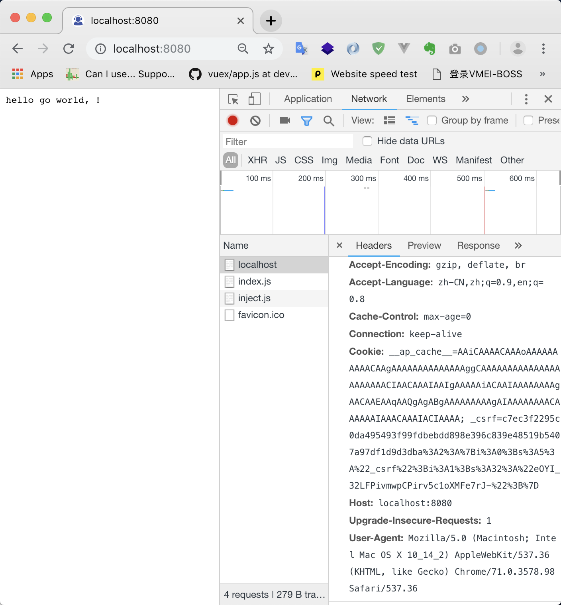

### 静态语言


### 高可扩展性


### hi i am golang home-page



build with docker 
expose port with  8080(mac) -> 80(docker)


### info
➜  app go version
go version go1.11.4 linux/amd64


### 多个文件如何运行
```go
go run app.go  key.go
```


### `$GOPATH`
###### 学个Golang真不容易,终于弄懂了`$GOPATH`的用途,, 他可以设置多个路径啊,第一路径自然是全局路径,`$HOME/golang/src/github`,第二路径是项目路径,用`;`隔开,,当设置好全局路径之后,目录下会生成三个目录, `src`源码source,`pkg`打包后的package,`bin`可执行命令
```
/home/user/go/
    src/
        crash/
            bang/              (go code in package bang)
                b.go
        foo/                   (go code in package foo)
            f.go
            bar/               (go code in package bar)
                x.go
            vendor/
                crash/
                    bang/      (go code in package bang)
                        b.go
                baz/           (go code in package baz)
                    z.go
            bar/              (go code in package main)
                y.go
```

> #### 用法
> cd $GOPATH => 你定义的环境变量
> ```
> import (
>   github.com/package   ->  which you git pull from github.com
> )
> ```
> go build github.com/<which path you install in gopath>


### `$GOROOT`
就是go的安装路径

### Golang 基本数据

> ### 基础类型
> int 整数 包括 int8 int16 int32 和 uInt8 uInt16 uInt32


> ### 聚合类型(复合类型)
> 数组map,数组是长度固定且拥有多个,其长度类型固定,拥有0个或者多个相同类型数据元素的序列.由于长度固定,所以golang很少用这个.
> slice 和 map都是动态增长类型的聚合类型,比较常用,想要理解slice,先要理解数组.


> ### 引用类型
> 指针


> ### 接口类型
