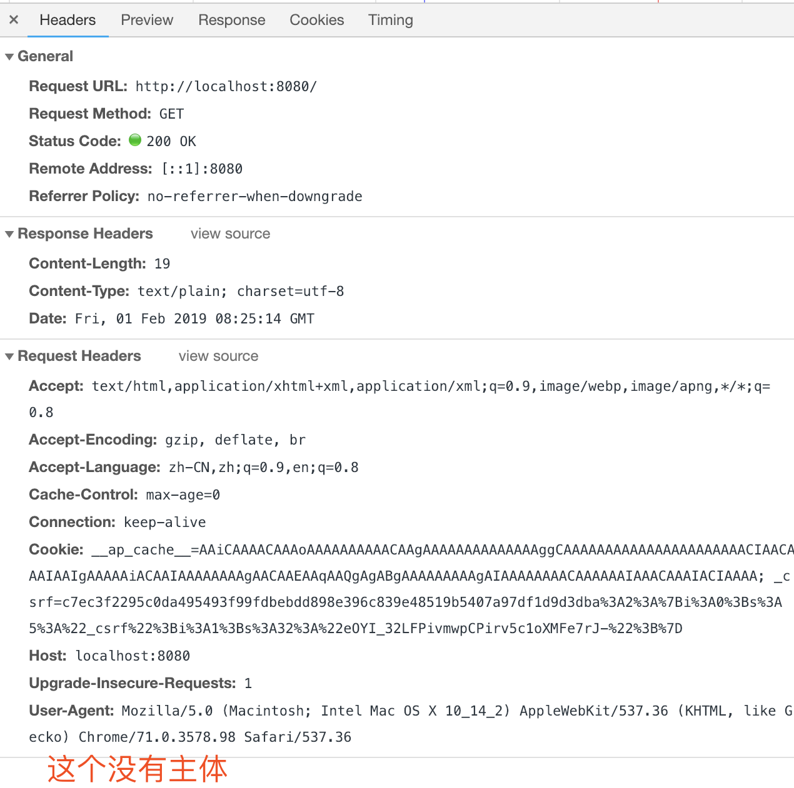

### http 缓存
### http 代理

用途: 缓存/日志/过滤/负载均衡/认证


### HTTP 访问控制（CORS）


### http headers



截图的头部请求组成4部分

------


> ### General 一般头部
> Request URL
> Request Method: GET/HEAD/POST/OPTIONS/PUT/DELETE/CONNECT/PATCH
> Status Code  101/200/301/404/502
> Remote Address <ip地址>


> ### Reponse Header 响应头部
> Content-type text/plain; charset=utf-8
> Content-Length 19  长度
> Date: Fri, 日期
> Server: apache/nginx
> 
> #### `curl -I baidu.com` 百度的响应头部
> ```http
> HTTP/1.1 200 OK
> Date: Fri, 01 Feb 2019 08:52:57 GMT
> Server: Apache
> Last-Modified: Tue, 12 Jan 2010 13:48:00 GMT
> ETag: "51-47cf7e6ee8400"
> Accept-Ranges: bytes
> Content-Length: 81
> Cache-Control: max-age=86400
> Expires: Sat, 02 Feb 2019 08:52:57 GMT
> Connection: Keep-Alive
> Content-Type: text/html
> Proxy-Connection: keep-alive
> ```


